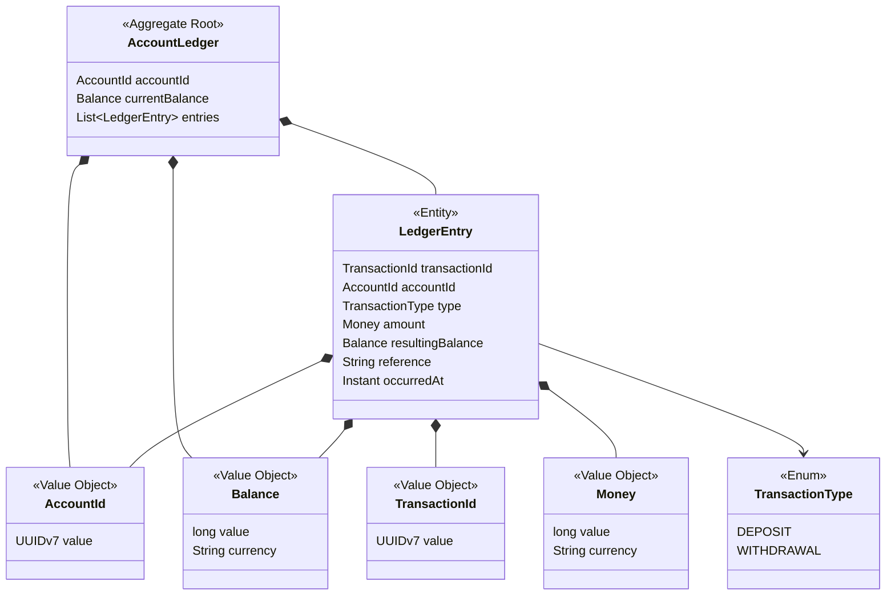

# Picobooks Specification

## API Contract

The service SHALL expose a small JSON HTTP API for account-scoped ledger operations.

### `GET /health`

Returns service health.

```json
{
  "status": "UP"
}
```

### `POST /accounts`

Creates an account and returns a producer-generated account identifier with HTTP `201 Created`.
Clients SHALL NOT provide account identifiers.

Request:

```json
{}
```

Response:

```json
{
  "accountId": "0198f3a5-7b1c-7d2e-8f90-123456789abc",
  "createdAt": "2026-05-15T12:00:00Z"
}
```

### `POST /accounts/{accountId}/transactions`

Records an accepted deposit or withdrawal for one existing account and returns the created ledger
entry with HTTP `201 Created`.

Request:

```json
{
  "type": "DEPOSIT",
  "amount": {
    "value": 10000,
    "currency": "GBP"
  },
  "reference": "Initial deposit"
}
```

Response:

```json
{
  "transactionId": "0198f3a6-45ef-7a10-8b22-89abcdef0123",
  "accountId": "0198f3a5-7b1c-7d2e-8f90-123456789abc",
  "type": "DEPOSIT",
  "amount": {
    "value": 10000,
    "currency": "GBP"
  },
  "resultingBalance": {
    "value": 10000,
    "currency": "GBP"
  },
  "reference": "Initial deposit",
  "occurredAt": "2026-05-15T12:00:00Z"
}
```

### `GET /accounts/{accountId}/balance`

Returns the current balance for one existing account with HTTP `200 OK`.

```json
{
  "accountId": "0198f3a5-7b1c-7d2e-8f90-123456789abc",
  "balance": {
    "value": 10000,
    "currency": "GBP"
  }
}
```

### `GET /accounts/{accountId}/transactions`

Returns accepted ledger entries for one existing account in append order with HTTP `200 OK`.

```json
[
  {
    "transactionId": "0198f3a6-45ef-7a10-8b22-89abcdef0123",
    "accountId": "0198f3a5-7b1c-7d2e-8f90-123456789abc",
    "type": "DEPOSIT",
    "amount": {
      "value": 10000,
      "currency": "GBP"
    },
    "resultingBalance": {
      "value": 10000,
      "currency": "GBP"
    },
    "reference": "Initial deposit",
    "occurredAt": "2026-05-15T12:00:00Z"
  }
]
```

### Error Responses

Invalid client requests return HTTP `400 Bad Request` with a stable error body. Error codes SHALL be
specific enough for clients to act without parsing message text.

```json
{
  "code": "insufficient_funds",
  "message": "Withdrawal would overdraw account",
  "occurredAt": "2026-05-15T12:00:00Z"
}
```

Recognized ledger error codes include:

- `account_not_found`
- `currency_mismatch`
- `insufficient_funds`
- `invalid_account_id`
- `invalid_amount`
- `invalid_currency`
- `invalid_transaction_type`

## Wire Rules

- `accountId` SHALL be a service-generated UUID v7 path value.
- `transactionId` SHALL be a service-generated UUID v7 value.
- `type` SHALL be `DEPOSIT` or `WITHDRAWAL`.
- Money `value` SHALL be a positive integer in currency base units, such as pence for GBP.
- Balance `value` SHALL be a non-negative integer in currency base units.
- `currency` SHALL be accepted case-insensitively and normalized to uppercase three-letter form.
- `reference` MAY be omitted or blank; accepted entries SHALL return the stored reference value.
- `occurredAt` and `createdAt` SHALL be ISO-8601 instants.
- Floating point money values SHALL NOT be accepted.

## Behavior Requirements

### Requirement: Run as a local web application

The service SHALL expose HTTP APIs and run locally without requiring optional infrastructure beyond
Java, Maven, and project dependencies.

#### Scenario: Service health can be checked

- WHEN a client sends `GET /health`
- THEN the service responds successfully
- AND the response body is `{ "status": "UP" }`

### Requirement: Create an account explicitly

The service SHALL create accounts only through an explicit account creation operation.

#### Scenario: Account created

- WHEN a client sends `POST /accounts`
- THEN the service creates an account
- AND the account is identified by a producer-generated UUID v7 `accountId`

#### Scenario: Client-provided account identifiers are not accepted for account creation

- WHEN a client creates an account
- THEN the client does not provide an account identifier
- AND uniqueness and identifier format are enforced by the service

#### Scenario: Transaction rejected for unknown account

- WHEN a client submits a transaction for an account that has not been created
- THEN the service rejects the request with `account_not_found`
- AND no ledger entry is recorded

### Requirement: Record a deposit

The service SHALL allow a client to record a positive deposit for an existing account.

#### Scenario: Deposit accepted

- WHEN a client submits a deposit for an account
- AND the amount is positive
- AND the currency is valid for that account
- THEN the account ledger appends an immutable ledger entry
- AND the account balance increases by the deposit amount

### Requirement: Record a withdrawal

The service SHALL allow a client to record a positive withdrawal for an existing account when
sufficient funds are available.

#### Scenario: Withdrawal accepted

- WHEN a client submits a withdrawal for an account
- AND the amount is positive
- AND the account has sufficient funds
- AND the currency is valid for that account
- THEN the account ledger appends an immutable ledger entry
- AND the account balance decreases by the withdrawal amount

#### Scenario: Withdrawal rejected for insufficient funds

- WHEN a client submits a withdrawal that would make the account balance negative
- THEN the service rejects the request with `insufficient_funds`
- AND no ledger entry is recorded

### Requirement: View current balance

The service SHALL allow a client to view the current balance for an existing account.

#### Scenario: Balance returned

- WHEN a client requests the balance for an account with accepted ledger entries
- THEN the service returns the latest authoritative resulting balance
- AND the balance is expressed in currency base units and currency

### Requirement: View transaction history

The service SHALL allow a client to view transaction history for an existing account.

#### Scenario: History returned

- WHEN a client requests transaction history for an account
- THEN the service returns accepted ledger entries for that account in append order
- AND each entry includes transaction type, amount, resulting balance, reference, and occurrence time

### Requirement: Represent money in currency base units

The service SHALL represent money as an integer value with a three-letter currency code.

#### Scenario: Floating point values are not accepted

- WHEN a client submits an amount
- THEN the amount is represented as an integer `value`
- AND not as a floating point decimal

#### Scenario: Non-positive amounts are rejected

- WHEN a client submits zero or a negative amount
- THEN the service rejects the request with `invalid_amount`
- AND no ledger entry is recorded

### Requirement: Use a single currency per account

The service SHALL treat the first accepted transaction as establishing the account currency.

#### Scenario: First transaction establishes currency

- WHEN the first transaction for an account is accepted
- THEN that transaction's currency becomes the account currency

#### Scenario: Later transaction with different currency is rejected

- GIVEN an account has an established currency
- WHEN a later transaction uses a different currency
- THEN the service rejects the request with `currency_mismatch`
- AND no ledger entry is recorded

## Domain Object Definitions



- **AccountId**: Value object wrapping a producer-generated UUID v7 account identifier.
- **TransactionId**: Value object wrapping a producer-generated UUID v7 ledger-entry identifier.
- **Money**: Value object for a positive transaction amount and normalized three-letter currency.
- **Balance**: Value object for a non-negative current account position and currency.
- **TransactionType**: Enumeration of `DEPOSIT` and `WITHDRAWAL`.
- **LedgerEntry**: Immutable accepted transaction entity containing transaction id, account id,
  transaction type, amount, resulting balance, optional reference, and occurrence time.
- **AccountLedger**: Aggregate root for exactly one account. It owns currency consistency, balance
  calculation, sufficient-funds checks, and append-only entry creation.

## Solution Space

### Object Graph

The API controller maps JSON into application commands. Account creation uses no client-provided
identifier; the application creates an `AccountLedger` with a producer-generated `AccountId`.

Transaction commands address exactly one existing `AccountId`. The application service loads that
one `AccountLedger`, asks the aggregate to accept or reject the transaction, and saves only that
account's resulting ledger state. Read operations load only the requested account's ledger state and
project it into API responses.

No domain object named or behaving as a global ledger SHALL coordinate multiple accounts. No global
ledger aggregate SHALL own balances, entries, or transaction ordering across accounts.

### Resulting Balance Decision

Each `LedgerEntry` stores the resulting balance after that entry is accepted. This is deliberate:
insufficient-funds rejection requires transactionality and ordering for each account so concurrent
withdrawals cannot both observe the same old balance and overdraw the account.

The latest entry's `resultingBalance` is authoritative for reads, which avoids replaying the full
entry list for every balance request. This introduces contention only inside one account aggregate;
there is no global ledger lock or cross-account balance owner.

### In-Memory Data Model

The in-memory store SHALL be partitioned by `AccountId`. Each account partition owns its ordered
collection of `LedgerEntry` records, its latest `Balance`, and an account-scoped lock object.

Account creation is explicit: `POST /accounts` creates the partition. Balance, history, and
transaction writes for unknown account identifiers are rejected with `account_not_found`.

Balance and history reads for one account SHALL NOT require scanning other accounts.

### Cross-Account Query Model

The write model is account-scoped, but the design SHALL NOT prevent future operational intelligence
or fraud-detection reads across account aggregates. A future read-side projection or secondary index
MAY index immutable ledger entries by `occurredAt`, transaction type, currency, and account id to
support cross-account time-window queries.

Such projections are read models. They SHALL NOT own balances, enforce insufficient-funds rules, or
coordinate account writes.

### Concurrency And Contention Decision

Contention SHALL be possible only at the account level. The in-memory implementation proposes one
account-scoped lock object per account partition. Concurrent operations for different accounts MUST
NOT share a domain lock, aggregate lock, or global ledger lock.

This in-memory lock strategy does not scale horizontally: two requests routed to different service
instances do not share lock objects. A horizontally scaled design would need account-local
serialization in shared infrastructure, such as a memory-first distributed key/value store, or a
different technology chosen for throughput, locality, and operational requirements.

The service does not provide cross-account transactions, transfers, global balances, global history,
or global ordering guarantees.
